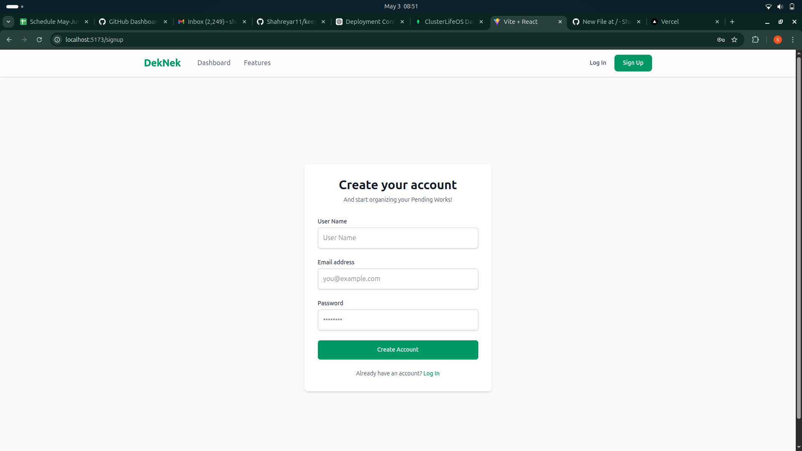
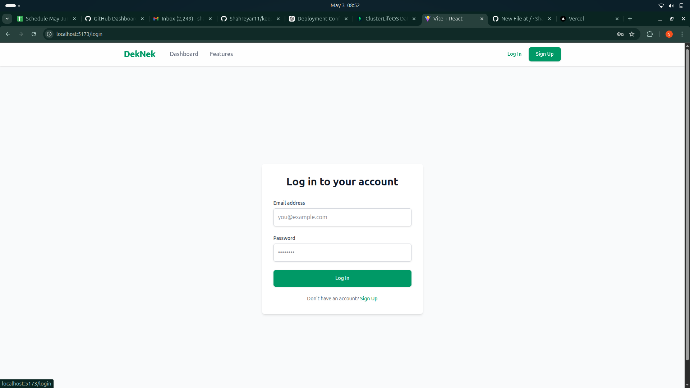
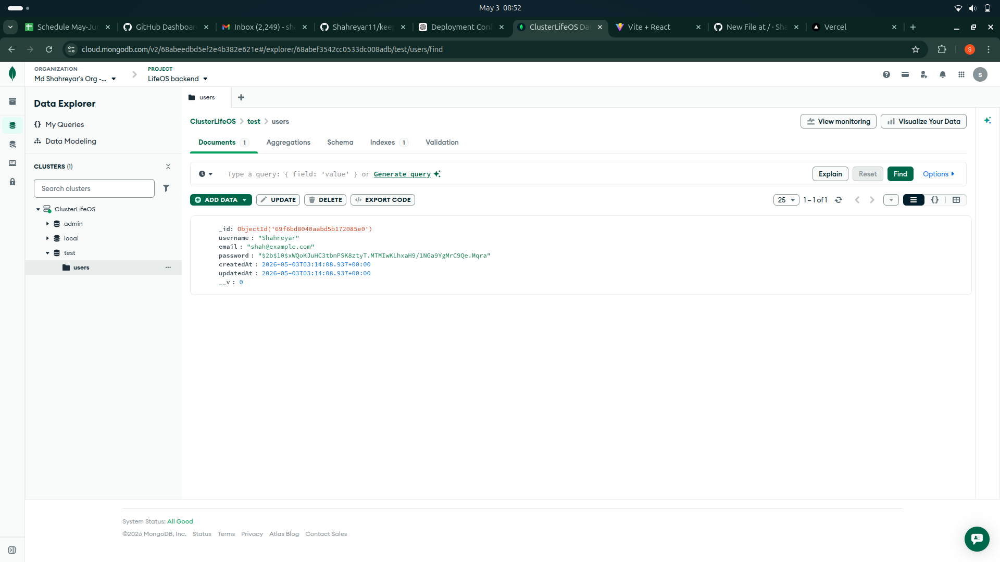

# 🚀 Authentication Web App (MongoDB Atlas)

## 📌 Overview
This is a full-stack authentication web application that allows users to **Sign Up** and **Log In** securely using MongoDB Atlas.

---

## 🔑 Features
- User Signup & Login system  
- Secure password hashing (bcrypt)  
- MongoDB Atlas cloud database  
- Fast API communication  
- Secure authentication flow  

---

## 🧠 How It Works

### Signup
- User enters details  
- Password is hashed  
- Stored in MongoDB Atlas  

### Login
- User enters credentials  
- Password is verified with hashed version  
- Access granted if valid  

---

## 🔒 Security
- Passwords are NOT stored in plain text  
- Uses hashing (bcrypt)  
- Protects user data  

---

## 🗄️ Database
- MongoDB Atlas (Cloud Database)  
- Stores user credentials securely  

---

## 🛠️ Tech Stack
- Frontend: HTML, CSS, JavaScript  
- Backend: Node.js, Express  
- Database: MongoDB Atlas  
- Auth: bcrypt  

---

## 📸 Screenshots

### Signup Page


### Login Page


### Database


---

## ⚙️ Setup

```bash
git clone https://github.com/your-username/your-repo.git
cd your -repo
cd client
npm i
npm run dev
cd ..
cd server
npm i
node index.js
